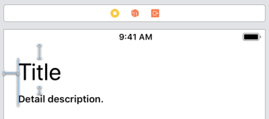
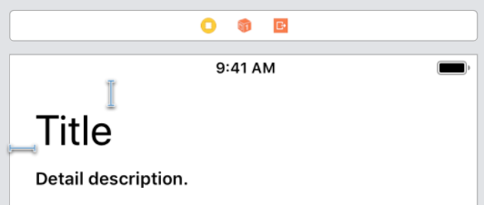
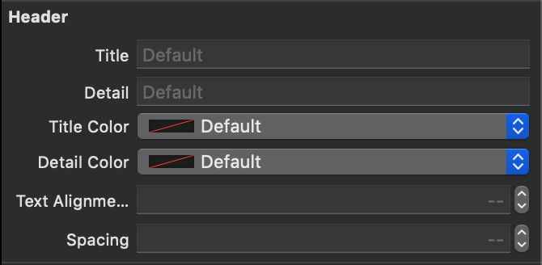

# Before



Each time you have to copy paste this, and pay attention to not forgot to change it in your UITableViewCell or make a mistake writing a wrong number.

```swift
titleLabel.text = "Title"
titleLabel.textColor = .black
titleLabel.font = .systemFont(ofSize: 34.0, weight: .regular)

detailLabel.text = "Detail description."
detailLabel.textColor = .black
detailLabel.font = .systemFont(ofSize: 14.0, weight: .semibold)

spacingConstraint.constant = 10.0
```

Total:

- 4 constraints
- 7 lines of code to duplicate

# With Sejima



Each time you need this:

```swift
header.title = "Title"
header.detail = "Detail description."
```

##### UIAppearance

And to doesn’t make mistake, just **once** in a ThemeManager or what you want:

```swift
// Appearance for every MUHeader instance
MUHeader.appearance().titleColor = .black
MUHeader.appearance().titleFont = .systemFont(ofSize: 34.0, weight: .regular)
MUHeader.appearance().detailColor = .black
MUHeader.appearance().detailFont = .systemFont(ofSize: 14.0, weight: .semibold)
MUHeader.appearance().spacing = 10.0

// Appearance for a specific parent class
for vc in [UITableViewCell.self] {
    MUHeader.appearance(whenContainedInInstancesOf: [vc]).titleFont = .systemFont(ofSize: 14.0, weight: .light)
    MUHeader.appearance(whenContainedInInstancesOf: [vc]).detailFont = .systemFont(ofSize: 10.0, weight: .bold)
    MUHeader.appearance(whenContainedInInstancesOf: [vc]).spacing = 4.0
}
```

Total:

- 2 constraints
- 2 lines of code to duplicate
- 8 lines of code to be sure your header always look the same

##### One more thing

You can also design it directly in your `.xib`/`.storyboard` using `@IBInspectable`.

