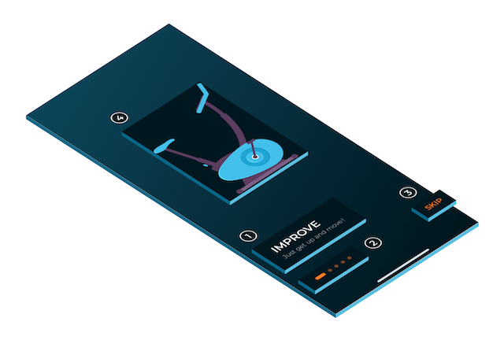

[](https://moveupwards.github.io/Sejima/)
[](https://developer.apple.com/swift)

[](https://github.com/Carthage/Carthage)
[](http://cocoapods.org/pods/Sejima)
[](https://app.codacy.com/app/MoveUpwardsDev/Sejima?utm_source=github.com&utm_medium=referral&utm_content=MoveUpwards/Sejima&utm_campaign=Badge_Grade_Settings)

[](https://github.com/MoveUpwards/Sejima/blob/master/LICENSE)
[](https://github.com/MoveUpwards/Sejima/graphs/contributors)
[](https://paypal.me/moveupwards)

## Why Sejima

Because in modern mobile applications, you often reuse user interface components. To avoid code duplication, we have tried to provide you with global standard user interface components.

Although Apple has introduce `@IBInspectable` properties to help define components directly in storyboard files.

All `Sejima` components expose its components properties using `@IBInspectable` so you can define user interface directly in your `.xib`/`.storyboard` files or using `UIAppearance`.

## Requirements

- iOS 9.0+
- Xcode 9.0+

## Installation

### use [CocoaPods](https://cocoapods.org) with Podfile

```swift
pod 'Sejima'
```

open your favorite terminal, go to your project root path:

```shell
pod install
```

### use [Carthage](https://github.com/Carthage/Carthage) with Cartfile

```shell
github "MoveUpwards/Sejima"
```

open your favorite terminal, go to your project root path and run:

```shell
carthage update
```

## Features

- [**MUHeader:**](./Examples/MUHeader.md) Component that define a title and a detail description.


- **MUTopBar:** Component that define a title and a button on left side.


- **MUButton:** UIButton with more customizable options.


- **MUHorizontalPager:** UIScrollView + isPagingEnabled with more customizable options.

- **MUPageControl:** UIPageControl with more customizable options.


- **MUTextField:** UITextField with more customizable options.


- **MUNavigationBar:** Component that define a left button along with a main button with a separator.
  


- **MUAvatar:** UIImage with possible design round, square or custom.


- **MUTag:** Component that define a title.
  


- **MUPinCode:** Component to handle pin code usage with possibly being alpha-numeric, emoji, numeric.


- **MUSegmentedControl:** UISegmentedControl like with more designable options.


- **MUProgress:** An horizontal progress bar with multiple sections.


- **MUTrimmer:** A draggable component usually used to trim vidéo.


## Example

### Walkthrough

Have a look in the sample project to see how to create a complete walkthrough with the following Sejima components:

1. MUHeader
2. MUPageControl
3. MUButton
4. MUHorizontalPager



## Sketch template

To help you design applications using Sejima components in [Sketch](https://sketchapp.com/) we provide a Sketch template with all our components available in Symbols.

[Sketch template](./Screenshots/Sketch.png)

## Contributing

Please read our [Contributing Guide](./CONTRIBUTING.md) before submitting a Pull Request to the project.

## Support

For more information on the upcoming version, please take a look to our [ROADMAP](https://github.com/MoveUpwards/Sejima/projects/).

#### Community support

For general help using Strapi, please refer to [the official Sejima documentation](https://moveupwards.github.io/Sejima/). For additional help, you can use one of this channel to ask question:

- [StackOverflow](http://stackoverflow.com/questions/tagged/sejima)
- [Slack](http://moveupwards.slack.com) (highly recommended for faster support)
- [GitHub](https://github.com/MoveUpwards/Sejima).

#### Professional support

We provide a full range of solutions to get better and faster results. We're always looking for the next challenge: consulting, training, develop mobile and web solution, etc.

[Drop us an email](mailto:support@moveupwards.dev) to see how we can help you.

## License

Folding cell is released under the MIT license.
See [LICENSE](./LICENSE) for details.

If you use the open-source library in your project, please make sure to credit and backlink to www.moveupwards.dev
